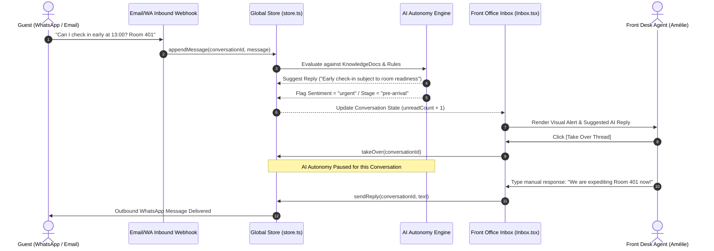
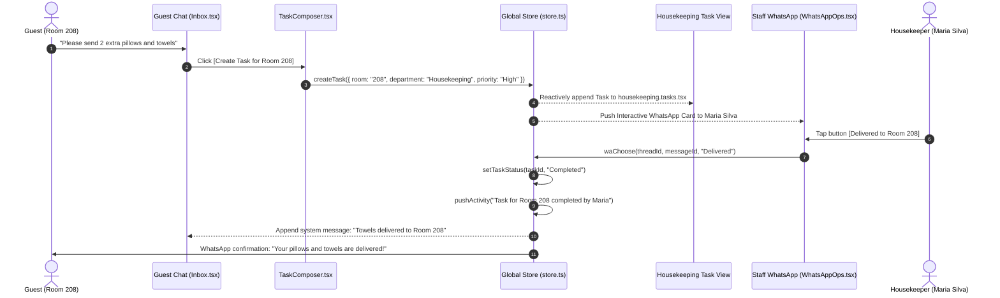
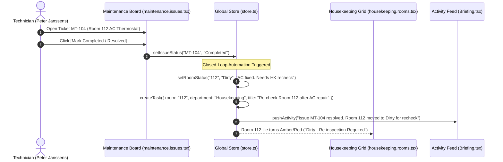

# Hotelogx Connect — Product Requirement Document (PRD) & Technical Architecture

**Document Version:** 1.0.0 (Production Architecture)  
**Status:** Design-Complete Frontend & In-Memory Workflow Specification  
**Reference Codebase:** `hotelogx-connect` (Antwerp Property: Hotel Mercier)  

---

## 1. System Technology Stack

| Layer | Technology | Version | Purpose in Hotelogx Connect |
|---|---|---|---|
| **Core Framework** | React | `19.2.8` | Component rendering, concurrent transitions, declarative UI tree |
| **Language** | TypeScript | `5.9.3` | `strict` mode with `noUnusedLocals` & `noUnusedParameters` |
| **Build & Bundler** | Vite | `7.3.6` | Sub-second HMR, modern ESM production bundling |
| **Routing** | `@tanstack/react-router` | `1.168.22` | File-based type-safe routing, flat dotted filename hierarchy |
| **Global State** | `@tanstack/react-store` | `0.10.0` | Reactive in-memory state engine, single source of truth |
| **Styling** | Tailwind CSS | `4.2.2` | CSS custom tokens in `src/styles.css` (warm paper palette) |
| **Icons** | `lucide-react` | `0.576.0` | Clean line icons (`size-3` to `size-4` scale) |
| **Serverless Functions** | Netlify Edge / Functions | `ESM .mts` | Inbound email domain detection & DNS MX/SRV resolution |

---

## 2. Complete Route Tree & Role Guard Architecture

All application routes reside in `src/routes/` and are wrapped within the `<AppShell>` component. `<AppShell>` acts as the central layout and auth guard, enforcing valid session hydration from `src/lib/session.ts`.

```
src/routes/
├── __root.tsx                      # Root layout shell, fonts, toast viewport, session listener
├── index.tsx                       # Redirects root URL '/' to current staff role's home view
├── login.tsx                       # Staff account picker (Jonas, Amélie, Rosa, Peter, Thibault)
├── onboarding.tsx                  # 7-Step property setup wizard (/onboarding)
│
├── front-office.index.tsx          # Front Desk Overview (Today's arrivals, departures, VIPs)
├── front-office.conversations.tsx  # Omnichannel guest inbox with AI co-pilot
├── front-office.tasks.tsx          # Desk-specific tasks, VIP prep, incoming floor updates
│
├── housekeeping.index.tsx          # Housekeeping Dashboard (Turnover progress, active cleaners)
├── housekeeping.rooms.tsx          # 48-Room visual grid across 4 floors with 8 states
├── housekeeping.tasks.tsx          # Linen deliveries, baby cot setups, guest supply requests
│
├── maintenance.index.tsx           # Engineering Dashboard (Open breakdowns, priority triage)
├── maintenance.issues.tsx          # Maintenance tickets (HVAC, plumbing, keycards)
├── maintenance.tasks.tsx           # Technician work orders with WhatsApp dispatch
│
├── manager.index.tsx               # General Manager Dashboard & Executive AI Briefing
├── manager.conversations.tsx       # Property-wide conversation intelligence & sentiment audit
├── manager.tasks.tsx               # Cross-departmental task control board
├── manager.upsells.tsx             # Ancillary revenue pipeline (Accepted / Pending / Declined)
└── manager.settings.tsx            # AI autonomy rules, Knowledge docs upload, Property profile
```

### Role Routing Map (`src/lib/session.ts`)

| Staff Role (`Role`) | Default Home Route | Primary Workspace Intent |
|---|---|---|
| `manager` | `/manager` | Morning briefing, RevPAR/Occupancy KPIs, Escalations, AI rules |
| `front-office` | `/front-office` | Arrivals board, Guest WhatsApp/Email inbox, Rapid task dispatch |
| `housekeeping` | `/housekeeping/rooms` | 48-room live turnover board, linen tasks, cleaning type filters |
| `maintenance` | `/maintenance/issues` | Equipment defect tickets, out-of-service status, SLA countdowns |

---

## 3. End-to-End Operational Workflows (Sequence Diagrams)

### 3.1. Omnichannel AI Guest Messaging & Human Takeover

This workflow illustrates how a guest inquiry via WhatsApp or Email is processed autonomously by the AI using indexed Knowledge Docs, and how a human agent intervenes when sentiment flags an urgent issue.



---

### 3.2. Task Delegation & Cross-Department Coordination

This workflow traces a towel request originating from a guest chat, through AI auto-detection, Front Desk task creation, floor staff completion via WhatsApp, and automatic guest notification.



---

### 3.3. Closed-Loop Maintenance Defect & Auto-Recheck Lifecycle

When a technical defect is repaired, Hotelogx Connect ensures the room is not immediately marked clean. It automatically triggers a mandatory housekeeping re-check.



---

## 4. State Model Specification (`src/lib/store.ts`)

The entire operational intelligence of Hotelogx Connect is governed by a singular, reactive `AppState` interface:

```typescript
export interface AppState {
  // Operational Collections
  conversations: Conversation[];
  tasks: Task[];
  rooms: Room[];
  issues: Issue[];
  upsells: Upsell[];
  knowledgeDocs: KnowledgeDoc[];
  aiRules: AiRule[];
  activity: ActivityItem[];
  waThreads: WaThread[];
  
  // UI & Environment State
  toasts: Toast[];
  currentStaffId: string;
  onboarding: OnboardingState;
  
  // Static Reference Data
  hotel: HotelProfile;
  subscription: Subscription;
  invoices: Invoice[];
  planTiers: PlanTier[];
}
```

### Domain Sub-Type Contracts (`src/lib/types.ts`)

#### 1. `Room` Entity
```typescript
export interface Room {
  number: string;                     // e.g. "101" - "408" (48 total)
  floor: number;                      // 1, 2, 3, or 4
  status: RoomStatus;                 // "Dirty" | "Cleaning" | "Clean" | "Inspected" | "DND" | "Guest Inside" | "Maintenance" | "Blocked"
  cleaningType: CleaningType;         // "Departure" | "Stayover" | "Stayover + Linen" | "VIP Arrival" | "Deep Clean" | "Turndown"
  guestStatus: string;                // "Vacant", "In House", "Due Out"
  arrivalTime?: string;               // e.g. "13:00"
  priority: Priority;                 // "Urgent" | "High" | "Normal" | "Low"
  cleaner?: string;                   // "Maria Silva", "Inês Duarte", etc.
  updatedAt: string;                  // "08:30"
  vip: boolean;                       // true / false
  note?: string;                      // Operational note
}
```

#### 2. `Task` Entity
```typescript
export interface Task {
  id: string;                         // e.g. "t-101"
  title: string;                      // Task summary
  detail?: string;                    // Detailed description
  room?: string;                      // Associated room number
  guest?: string;                     // Guest name
  department: Department;             // "Front Office" | "Housekeeping" | "Maintenance" | "VIP" | "Billing" | "Follow-up"
  priority: Priority;                 // "Urgent" | "High" | "Normal" | "Low"
  createdAt: string;                  // HH:MM
  due?: string;                       // Target completion time
  assignee?: string;                  // Assigned staff name
  status: TaskStatus;                 // "New" | "Assigned" | "In Progress" | "Waiting" | "Completed" | "Escalated"
  source: TaskSource;                 // "Guest WhatsApp" | "Guest Email" | "AI Detection" | "Manager" | "Front Office"
  conversationId?: string;            // Linked guest conversation
  trail: {
    at: string;
    text: string;
    via?: "whatsapp" | "dashboard" | "ai";
  }[];
}
```

#### 3. `Issue` Entity (Maintenance)
```typescript
export interface Issue {
  id: string;                         // e.g. "MT-101"
  room: string;                       // Room number
  title: string;                      // Equipment defect summary
  detail?: string;                    // Technical notes
  priority: Priority;                 // "Urgent" | "High" | "Normal" | "Low"
  reportedBy: string;                 // Staff or Guest name
  via: string;                        // "Front Office", "WhatsApp", etc.
  createdAt: string;                  // HH:MM
  assignee?: string;                  // Technician name (e.g. "Peter Janssens")
  status: "Open" | "Accepted" | "In Progress" | "Waiting Parts" | "Completed" | "Escalated";
  outOfService: boolean;              // If true, takes room off sale
  updates: {
    at: string;
    text: string;
    via?: "whatsapp" | "dashboard";
  }[];
}
```

---

## 5. Global Action Dispatches (`src/lib/store.ts`)

| Exported Action | Trigger Context | Primary State Changes | Cross-Department Side Effects |
|---|---|---|---|
| `setRoomStatus(number, status, note)` | Housekeeping Grid / WhatsApp button tap | Updates `Room.status` and `Room.updatedAt` | When set to `Clean`/`Inspected`, closes matching turnover task, logs `ActivityItem`, and notifies Front Desk. |
| `createTask(params)` | `TaskComposer.tsx` or AI Auto-Detection | Appends new `Task` record with initial audit trail entry | Dispatches interactive card to `WaThread` and creates global toast notification. |
| `setTaskStatus(id, status, note)` | Dashboard Task Row or WhatsApp action | Updates `Task.status` and appends `trail` item | When marked `Completed`, pushes message to linked `Conversation` informing guest of completion. |
| `setIssueStatus(id, status, note)` | Maintenance Board | Updates `Issue.status` and logs repair history | If `Completed`, resets room to `Dirty`, creates inspection task, and logs `ActivityItem`. |
| `takeOver(conversationId)` | Front Office Inbox | Sets `Conversation.aiStatus = "human-takeover"` | Locks out autonomous AI responses for this guest thread. |
| `sendReply(id, body, staffName)` | Front Office Inbox | Appends `Message` (author: "staff") to conversation | Resets unread counter, updates `lastAt`, and pushes toast. |
| `waChoose(threadId, messageId, label)`| `WhatsAppOps.tsx` mobile drawer | Records `chosen` label on `WaMessage` | Maps button labels (`Clean`, `Done`, `Fixed`) directly to `setRoomStatus` or `setTaskStatus`. |
